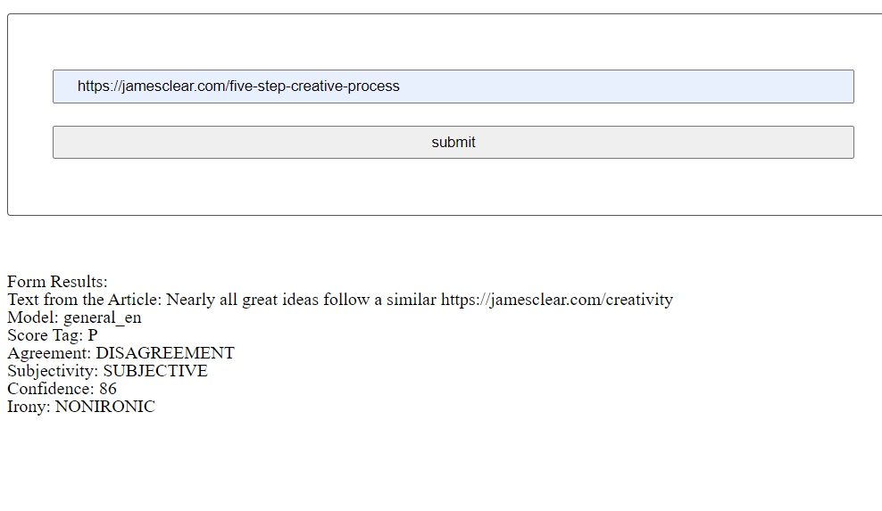

# Project Title
Evaluate a news article with Natural Language Processing

This project is a part of [Udacity](https://www.udacity.com/course/front-end-web-developer-nanodegree--nd0011) Front End Developer Nanodegree program.

## Table of Contents
- [Project Title](#project-title)
- [Table of contents](#table-of-contents)
- [Languages Used](#languages-used)
- [Description](#description)
- [Motivation](#motivation)
- [Installation](#installation)
- [Contribute](#contribute)
- [ScreenShots](#screenshots)
- [License & Copyright](#license--copyright)

## Languages used
1. Html
2. Cs
3. JavaScript
4. Node js
5. Express js
6. Sass 
7. Webpack Loaders and Plugins

[(Back to top)](#table-of-contents)

## Description
In this project you will be building a web tool that allow users to run Natural Langauge Processing(NLP) on articles or blogs found on other webiste. Using exciting  an execiting new API called MeaningCloud, you can build a simple web interface with their NLP system. This tool will give back pertinent information about the articel: whether the content is subjective (opinion) or objective (fact-based) and whether it is positive, neutral, or negative in tone.

[(Back to top)](#table-of-contents)

## Motivation
The goal of this project is to give you practice with:
- Setting up Webpack
- Sass styles
- Webpack Loaders and Plugins
- Creating layouts and page design
- Service workers
- Using APIs and creating requests to external urls

[(Back to top)](#table-of-contents)

## Installation
First:
    You can Install this project to your PC using clone the repo to your github account then Download It as a ZIP File to your PC or Clone it using GIT git clone
Second:
    `cd` into your folder and run: `npm install`
    Create .env folder and put inside it API_KEY=**************************
    Create account in MeaningCloud to get Apikey
    To run Production `npm run build-prod` --> you will notice creation of dist folder
    To run development `npm run build-dev`
    Then `npm start` 
    TO run test function  `npm run test`

[(Back to top)](#table-of-contents)

## Contribute
-Udacity

[(Back to top)](#table-of-contents)

## Screenshots

[(Back to top)](#table-of-contents)

## License & Copyright
Udacity © Omar Shaheen

[(Back to top)](#table-of-contents)
